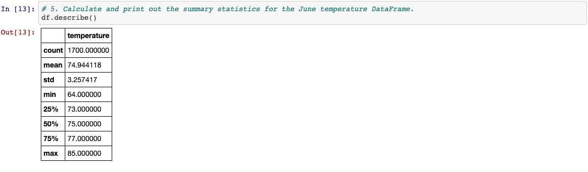
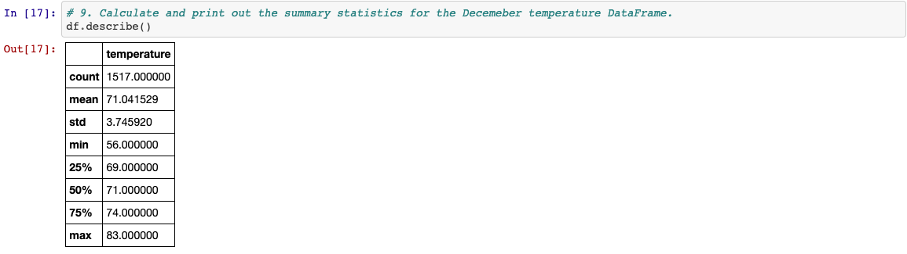

# SurfsUp_Analysis

## Table of Contents

- [Overview of the statistical analysis](#overview-of-the-statistical-analysis)
- [Results](#results)
- [Summary](#summary)

### Overview of the statistical analysis
  The purpose of the analysis is well defined.
  > Using Python, Pandas capacities and strategies, and SQLAlchemy, we'll channel the date section of the Measurements table in the hawaii.sqlite information base to recover every one of the temperatures for the long stretch of June. We'll then, at that point convert those temperatures to a rundown, make a DataFrame from the rundown, and create the outline insights. Once our dataframe is made we can get our outline insights by utilizing the df.describe() code

### Results
  There is a bulleted list that addresses the three key differences in weather between June and December.
  > Information provided gave us visibility that in the months of June and December
  > - June Temp 
  
  
  > - Demcember Temp
  

### Summary
  There is a high-level summary of the results and there are two additional queries to perform to gather more weather data for June and December.
  > In view of our Data Analysis, Data Provided, we can state as an undeniable level synopsis of results that the Standard deviation is 3.25 in June and 3.75 in December, having a 0.5 effect between the two seasons. 
 
  > Moreover, current information give ascribes such precipitation and others, with two inquiries that our investigation seeks after, performing climate information for June and December that assists results with choosing how we might want to fabricate the shop and what regions would make this area alluring to guests to make a trip and have an effective business.
